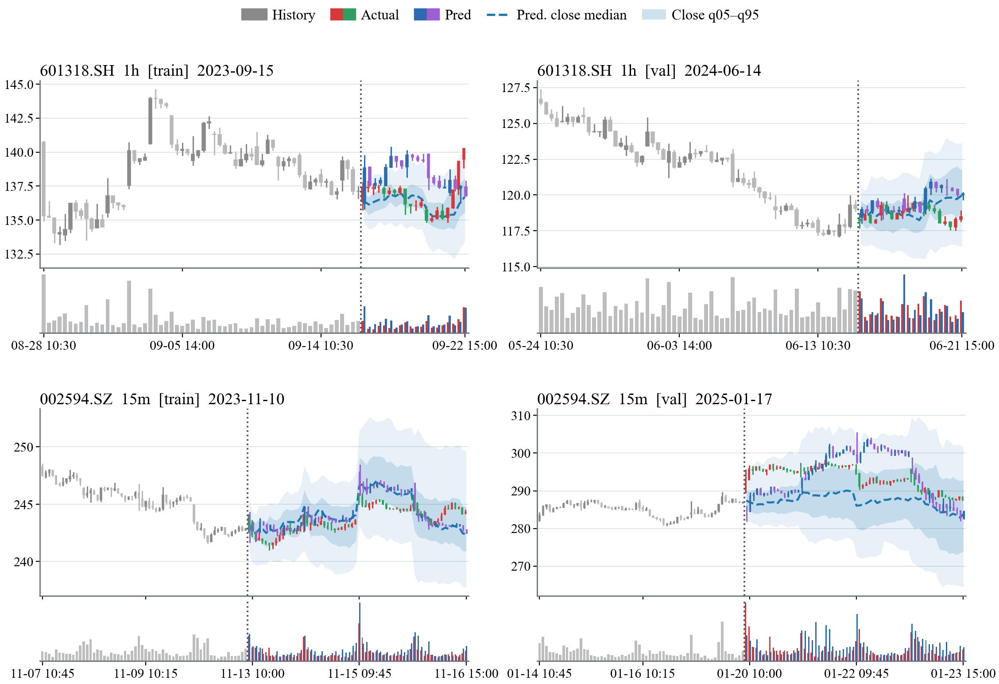

<h2 align="center">KiT: A Foundation Model for Candlestick Time-Series Forecasting via Diffusion Transformers</h2>

  

> KiT is a diffusion-based foundation model for candlestick (K-line) forecasting. It is trained on billions of bars spanning U.S. equities, Chinese A-shares, and cryptocurrencies across seven granularities, from one minute to one day, and achieves SOTA performance in both return forecasting and volatility prediction.

## Intro

KiT casts multi-horizon candlestick forecasting as conditional path generation via flow matching. The overall pipeline is illustrated above: raw OHLCV bars are encoded into a five-dimensional log-ratio state $x_t=(r_{\mathrm{gap}}, r_{\mathrm{body}}, r_{\mathrm{up}}, r_{\mathrm{dn}}, v_t)$, which is the state the diffusion model operates on. History and horizon are assembled into a single token sequence and processed by the KiT backbone, the history is returned bit-identical and only the forecast span is filled in with generated bars. In KiT block, signals that are constant over the window modulate every layer through a shared AdaLN trunk, whereas signals that vary per bar are added directly to the token embeddings.

## Prediciton Demo

### K-line forecasting

### Backtest

### Return & volatility forecasting

  
<table width="100%">
<thead>
<tr>
<th align="left">Method</th>
<th align="right">1m ↑</th>
<th align="right">5m ↑</th>
<th align="right">15m ↑</th>
<th align="right">30m ↑</th>
<th align="right">1h ↑</th>
<th align="right">2h ↑</th>
<th align="right">1d ↑</th>
<th align="right">Mean ↑</th>
</tr>
</thead>
<tbody>
<tr>
<td><strong>KiT</strong></td>
<td align="right"><strong>.0215</strong></td>
<td align="right"><strong>.0576</strong></td>
<td align="right"><strong>.0526</strong></td>
<td align="right"><strong>.0474</strong></td>
<td align="right"><strong>.0383</strong></td>
<td align="right"><strong>.0651</strong></td>
<td align="right"><strong>.1168</strong></td>
<td align="right"><strong>.0571</strong></td>
</tr>
<tr>
<td>Kronos-base</td>
<td align="right">.0158</td>
<td align="right">.0426</td>
<td align="right">.0442</td>
<td align="right">.0064</td>
<td align="right">.0128</td>
<td align="right">.0514</td>
<td align="right">.1046</td>
<td align="right">.0342</td>
</tr>
<tr>
<td>Kronos-base-FT</td>
<td align="right">.0192</td>
<td align="right">.0536</td>
<td align="right">.0484</td>
<td align="right">.0408</td>
<td align="right">.0304</td>
<td align="right">.0622</td>
<td align="right">.1101</td>
<td align="right">.0521</td>
</tr>
<tr>
<td>Sundial</td>
<td align="right">.0148</td>
<td align="right">.0386</td>
<td align="right">.0434</td>
<td align="right">.0082</td>
<td align="right">.0046</td>
<td align="right">.0214</td>
<td align="right">.0837</td>
<td align="right">.0209</td>
</tr>
<tr>
<td>Chronos-Bolt extended</td>
<td align="right">.0362</td>
<td align="right">.0088</td>
<td align="right">.0186</td>
<td align="right">.0964</td>
<td align="right">.0068</td>
<td align="right">.2159</td>
<td align="right">.0052</td>
<td align="right">.0461</td>
</tr>
<tr>
<td>Chronos-2</td>
<td align="right">.0168</td>
<td align="right">.0286</td>
<td align="right">.0362</td>
<td align="right">.0184</td>
<td align="right">.0162</td>
<td align="right">.0648</td>
<td align="right">.0556</td>
<td align="right">.0054</td>
</tr>
<tr>
<td>TimesFM 2.5</td>
<td align="right">.0126</td>
<td align="right">.0284</td>
<td align="right">.0160</td>
<td align="right">.0797</td>
<td align="right">.0089</td>
<td align="right">.0747</td>
<td align="right">.0116</td>
<td align="right">.0181</td>
</tr>
<tr>
<td>TimesFM 3</td>
<td align="right">.0046</td>
<td align="right">.0338</td>
<td align="right">.0374</td>
<td align="right">.0168</td>
<td align="right">.0294</td>
<td align="right">.0586</td>
<td align="right">.0479</td>
<td align="right">.0111</td>
</tr>
<tr>
<td>Historical return bootstrap</td>
<td align="right">.0296</td>
<td align="right">.0128</td>
<td align="right">.0346</td>
<td align="right">.0267</td>
<td align="right">.0341</td>
<td align="right">.0020</td>
<td align="right">.0982</td>
<td align="right">.0120</td>
</tr>
<tr>
<td>TimeGrad adapted</td>
<td align="right">.0136</td>
<td align="right">.0088</td>
<td align="right">.0362</td>
<td align="right">.0046</td>
<td align="right">.0248</td>
<td align="right">.0574</td>
<td align="right">.0792</td>
<td align="right">.0250</td>
</tr>
<tr>
<td>Diffusion-TS adapted</td>
<td align="right">.0090</td>
<td align="right">.0284</td>
<td align="right">.0206</td>
<td align="right">.0292</td>
<td align="right">.0746</td>
<td align="right">.0198</td>
<td align="right">.1654</td>
<td align="right">.0190</td>
</tr>
<tr>
<td>TSFlow adapted</td>
<td align="right">.0174</td>
<td align="right">.0554</td>
<td align="right">.0466</td>
<td align="right">.0228</td>
<td align="right">.0102</td>
<td align="right">.0596</td>
<td align="right">.0673</td>
<td align="right">.0399</td>
</tr>
</tbody>
</table>

Table 1. RankIC of Return forecasting.

 

<table width="100%">
<thead>
<tr>
<th align="left">Method</th>
<th align="right">1m ↑</th>
<th align="right">5m ↑</th>
<th align="right">15m ↑</th>
<th align="right">30m ↑</th>
<th align="right">1h ↑</th>
<th align="right">2h ↑</th>
<th align="right">1d ↑</th>
<th align="right">Mean ↑</th>
</tr>
</thead>
<tbody>
<tr>
<td><strong>KiT</strong></td>
<td align="right"><strong>.7599</strong></td>
<td align="right"><strong>.6947</strong></td>
<td align="right"><strong>.6900</strong></td>
<td align="right"><strong>.5919</strong></td>
<td align="right"><strong>.5958</strong></td>
<td align="right"><strong>.6652</strong></td>
<td align="right"><strong>.6225</strong></td>
<td align="right"><strong>.6600</strong></td>
</tr>
<tr>
<td>Kronos-base</td>
<td align="right">.5900</td>
<td align="right">.4934</td>
<td align="right">.3955</td>
<td align="right">.3049</td>
<td align="right">.4699</td>
<td align="right">.5281</td>
<td align="right">.4498</td>
<td align="right">.4617</td>
</tr>
<tr>
<td>Kronos-base-FT</td>
<td align="right">.6193</td>
<td align="right">.5478</td>
<td align="right">.4466</td>
<td align="right">.3671</td>
<td align="right">.4974</td>
<td align="right">.5306</td>
<td align="right">.4727</td>
<td align="right">.4974</td>
</tr>
<tr>
<td>Sundial</td>
<td align="right">.6024</td>
<td align="right">.5477</td>
<td align="right">.5164</td>
<td align="right">.4591</td>
<td align="right">.5691</td>
<td align="right">.5534</td>
<td align="right">.4486</td>
<td align="right">.5281</td>
</tr>
<tr>
<td>Chronos-Bolt extended</td>
<td align="right">.5766</td>
<td align="right">.4821</td>
<td align="right">.4113</td>
<td align="right">.4289</td>
<td align="right">.3543</td>
<td align="right">.3797</td>
<td align="right">.3310</td>
<td align="right">.4234</td>
</tr>
<tr>
<td>Chronos-2</td>
<td align="right">.4427</td>
<td align="right">.3944</td>
<td align="right">.3671</td>
<td align="right">.4092</td>
<td align="right">.4264</td>
<td align="right">.4452</td>
<td align="right">.2260</td>
<td align="right">.3873</td>
</tr>
<tr>
<td>TimesFM 2.5</td>
<td align="right">.5184</td>
<td align="right">.4609</td>
<td align="right">.4435</td>
<td align="right">.4537</td>
<td align="right">.5407</td>
<td align="right">.4688</td>
<td align="right">.3096</td>
<td align="right">.4565</td>
</tr>
<tr>
<td>TimesFM 3</td>
<td align="right">.3870</td>
<td align="right">.4655</td>
<td align="right">.4117</td>
<td align="right">.3474</td>
<td align="right">.4470</td>
<td align="right">.3977</td>
<td align="right">.2507</td>
<td align="right">.3867</td>
</tr>
<tr>
<td>GARCH</td>
<td align="right">.3520</td>
<td align="right">.5940</td>
<td align="right">.6469</td>
<td align="right">.4850</td>
<td align="right">.5842</td>
<td align="right">.5681</td>
<td align="right">.4255</td>
<td align="right">.5222</td>
</tr>
<tr>
<td>TimeGrad adapted</td>
<td align="right">.0736</td>
<td align="right">.1967</td>
<td align="right">.0056</td>
<td align="right">.1586</td>
<td align="right">.5201</td>
<td align="right">.4418</td>
<td align="right">.1702</td>
<td align="right">.1785</td>
</tr>
<tr>
<td>Diffusion-TS adapted</td>
<td align="right">.4462</td>
<td align="right">.1787</td>
<td align="right">.1483</td>
<td align="right">.0246</td>
<td align="right">.4236</td>
<td align="right">.3488</td>
<td align="right">.4563</td>
<td align="right">.2895</td>
</tr>
<tr>
<td>TSFlow adapted</td>
<td align="right">.3244</td>
<td align="right">.3230</td>
<td align="right">.4043</td>
<td align="right">.5658</td>
<td align="right">.5290</td>
<td align="right">.3648</td>
<td align="right">.5250</td>
<td align="right">.4338</td>
</tr>
</tbody>
</table>

Table 2. RankIC of Volatility prediction

## Get started

code will be available soon.

