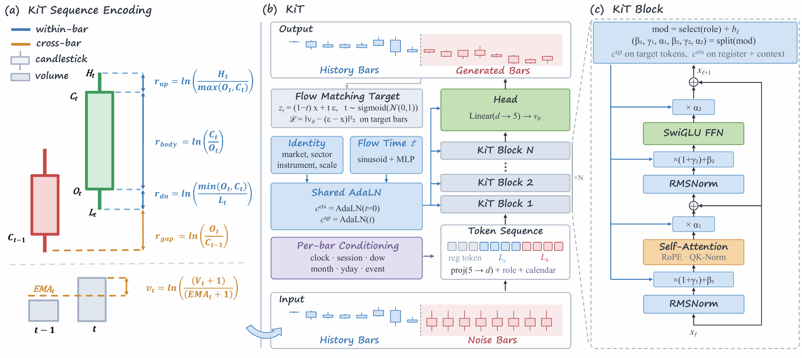
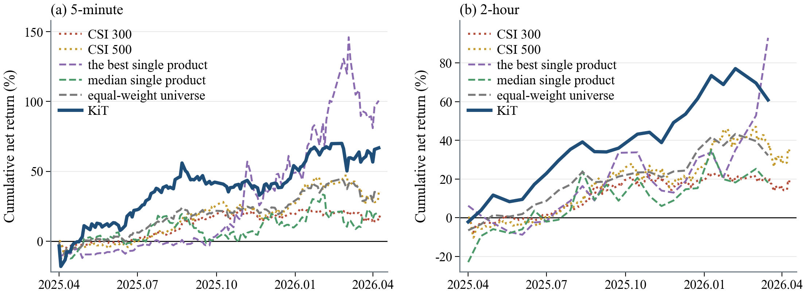
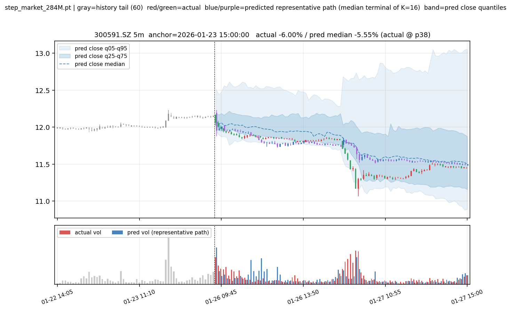
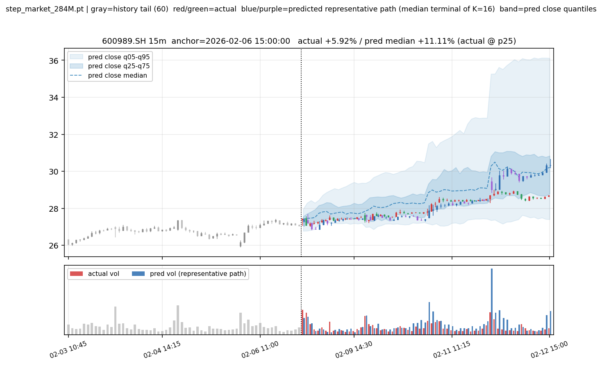
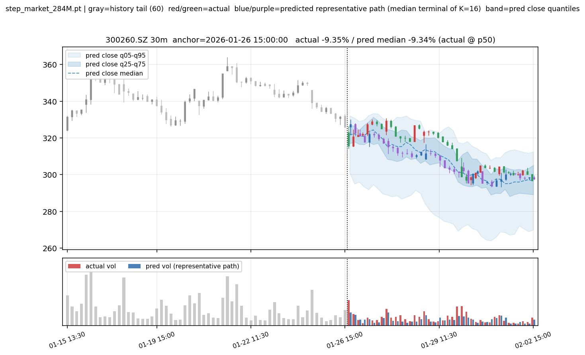
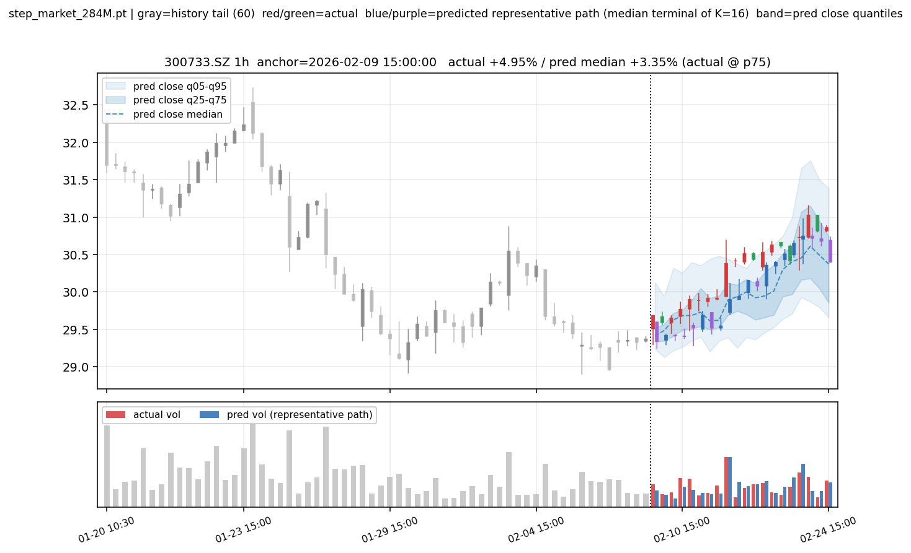
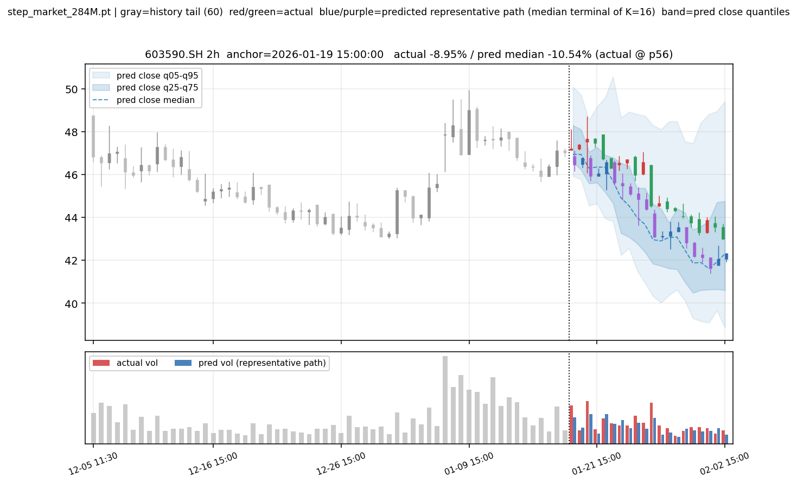
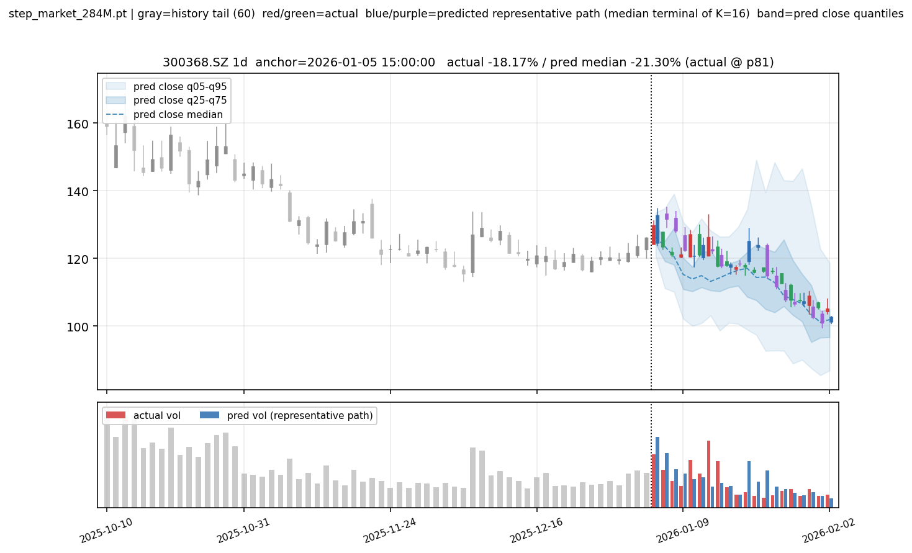
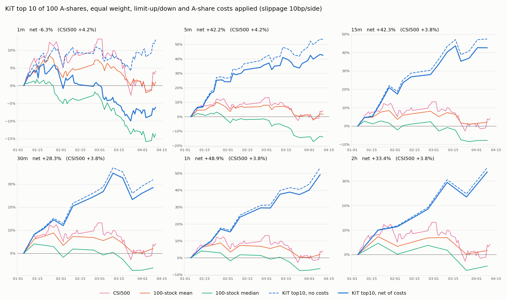

<h1 align="center">KiT: A Foundation Model for Candlestick Time-Series Forecasting via Diffusion Transformers</h1>


<div align="center">
  
[](https://arxiv.org/abs/2609.34507)
<a href="./LICENSE">
  
</a>
</div>


> KiT is a diffusion-based foundation model for candlestick (K-line) forecasting. It is trained on billions of bars spanning U.S. equities, Chinese A-shares, and cryptocurrencies across seven granularities, from one minute to one day, and achieves SOTA performance in both return forecasting and volatility prediction.


# Intro



KiT casts multi-horizon candlestick forecasting as conditional path generation via flow matching. The overall pipeline is illustrated above: raw OHLCV bars are encoded into a five-dimensional log-ratio state $x_t=(r_{\mathrm{gap}}, r_{\mathrm{body}}, r_{\mathrm{up}}, r_{\mathrm{dn}}, v_t)$, which is the state the diffusion model operates on. History and horizon are assembled into a single token sequence and processed by the KiT backbone, the history is returned bit-identical and only the forecast span is filled in with generated bars. In KiT block, signals that are constant over the window modulate every layer through a shared AdaLN trunk, whereas signals that vary per bar are added directly to the token embeddings.

# Prediciton Demo

## Backtest

<div align="center">

</div>

## Return & volatility forecasting

<div align="center">
  
<table width="100%">
<thead>
<tr>
<th align="left">Method</th>
<th align="right">1m ↑</th>
<th align="right">5m ↑</th>
<th align="right">15m ↑</th>
<th align="right">30m ↑</th>
<th align="right">1h ↑</th>
<th align="right">2h ↑</th>
<th align="right">1d ↑</th>
<th align="right">Mean ↑</th>
</tr>
</thead>
<tbody>
<tr>
<td><strong>KiT</strong></td>
<td align="right"><strong>.0215</strong></td>
<td align="right"><strong>.0576</strong></td>
<td align="right"><strong>.0526</strong></td>
<td align="right"><strong>.0474</strong></td>
<td align="right"><strong>.0383</strong></td>
<td align="right"><strong>.0651</strong></td>
<td align="right"><strong>.1168</strong></td>
<td align="right"><strong>.0571</strong></td>
</tr>
<tr>
<td>Kronos-base</td>
<td align="right">.0158</td>
<td align="right">.0426</td>
<td align="right">.0442</td>
<td align="right">.0064</td>
<td align="right">.0128</td>
<td align="right">.0514</td>
<td align="right">.1046</td>
<td align="right">.0342</td>
</tr>
<tr>
<td>Kronos-base-FT</td>
<td align="right">.0192</td>
<td align="right">.0536</td>
<td align="right">.0484</td>
<td align="right">.0408</td>
<td align="right">.0304</td>
<td align="right">.0622</td>
<td align="right">.1101</td>
<td align="right">.0521</td>
</tr>
<tr>
<td>Sundial</td>
<td align="right">.0148</td>
<td align="right">.0386</td>
<td align="right">.0434</td>
<td align="right">.0082</td>
<td align="right">.0046</td>
<td align="right">.0214</td>
<td align="right">.0837</td>
<td align="right">.0209</td>
</tr>
<tr>
<td>Chronos-Bolt extended</td>
<td align="right">.0362</td>
<td align="right">.0088</td>
<td align="right">.0186</td>
<td align="right">.0964</td>
<td align="right">.0068</td>
<td align="right">.2159</td>
<td align="right">.0052</td>
<td align="right">.0461</td>
</tr>
<tr>
<td>Chronos-2</td>
<td align="right">.0168</td>
<td align="right">.0286</td>
<td align="right">.0362</td>
<td align="right">.0184</td>
<td align="right">.0162</td>
<td align="right">.0648</td>
<td align="right">.0556</td>
<td align="right">.0054</td>
</tr>
<tr>
<td>TimesFM 2.5</td>
<td align="right">.0126</td>
<td align="right">.0284</td>
<td align="right">.0160</td>
<td align="right">.0797</td>
<td align="right">.0089</td>
<td align="right">.0747</td>
<td align="right">.0116</td>
<td align="right">.0181</td>
</tr>
<tr>
<td>TimesFM 3</td>
<td align="right">.0046</td>
<td align="right">.0338</td>
<td align="right">.0374</td>
<td align="right">.0168</td>
<td align="right">.0294</td>
<td align="right">.0586</td>
<td align="right">.0479</td>
<td align="right">.0111</td>
</tr>
<tr>
<td>Historical return bootstrap</td>
<td align="right">.0296</td>
<td align="right">.0128</td>
<td align="right">.0346</td>
<td align="right">.0267</td>
<td align="right">.0341</td>
<td align="right">.0020</td>
<td align="right">.0982</td>
<td align="right">.0120</td>
</tr>
<tr>
<td>TimeGrad adapted</td>
<td align="right">.0136</td>
<td align="right">.0088</td>
<td align="right">.0362</td>
<td align="right">.0046</td>
<td align="right">.0248</td>
<td align="right">.0574</td>
<td align="right">.0792</td>
<td align="right">.0250</td>
</tr>
<tr>
<td>Diffusion-TS adapted</td>
<td align="right">.0090</td>
<td align="right">.0284</td>
<td align="right">.0206</td>
<td align="right">.0292</td>
<td align="right">.0746</td>
<td align="right">.0198</td>
<td align="right">.1654</td>
<td align="right">.0190</td>
</tr>
<tr>
<td>TSFlow adapted</td>
<td align="right">.0174</td>
<td align="right">.0554</td>
<td align="right">.0466</td>
<td align="right">.0228</td>
<td align="right">.0102</td>
<td align="right">.0596</td>
<td align="right">.0673</td>
<td align="right">.0399</td>
</tr>
</tbody>
</table>

Table 1. RankIC of Return forecasting.

<br>


<table width="100%">
<thead>
<tr>
<th align="left">Method</th>
<th align="right">1m ↑</th>
<th align="right">5m ↑</th>
<th align="right">15m ↑</th>
<th align="right">30m ↑</th>
<th align="right">1h ↑</th>
<th align="right">2h ↑</th>
<th align="right">1d ↑</th>
<th align="right">Mean ↑</th>
</tr>
</thead>
<tbody>
<tr>
<td><strong>KiT</strong></td>
<td align="right"><strong>.7599</strong></td>
<td align="right"><strong>.6947</strong></td>
<td align="right"><strong>.6900</strong></td>
<td align="right"><strong>.5919</strong></td>
<td align="right"><strong>.5958</strong></td>
<td align="right"><strong>.6652</strong></td>
<td align="right"><strong>.6225</strong></td>
<td align="right"><strong>.6600</strong></td>
</tr>
<tr>
<td>Kronos-base</td>
<td align="right">.5900</td>
<td align="right">.4934</td>
<td align="right">.3955</td>
<td align="right">.3049</td>
<td align="right">.4699</td>
<td align="right">.5281</td>
<td align="right">.4498</td>
<td align="right">.4617</td>
</tr>
<tr>
<td>Kronos-base-FT</td>
<td align="right">.6193</td>
<td align="right">.5478</td>
<td align="right">.4466</td>
<td align="right">.3671</td>
<td align="right">.4974</td>
<td align="right">.5306</td>
<td align="right">.4727</td>
<td align="right">.4974</td>
</tr>
<tr>
<td>Sundial</td>
<td align="right">.6024</td>
<td align="right">.5477</td>
<td align="right">.5164</td>
<td align="right">.4591</td>
<td align="right">.5691</td>
<td align="right">.5534</td>
<td align="right">.4486</td>
<td align="right">.5281</td>
</tr>
<tr>
<td>Chronos-Bolt extended</td>
<td align="right">.5766</td>
<td align="right">.4821</td>
<td align="right">.4113</td>
<td align="right">.4289</td>
<td align="right">.3543</td>
<td align="right">.3797</td>
<td align="right">.3310</td>
<td align="right">.4234</td>
</tr>
<tr>
<td>Chronos-2</td>
<td align="right">.4427</td>
<td align="right">.3944</td>
<td align="right">.3671</td>
<td align="right">.4092</td>
<td align="right">.4264</td>
<td align="right">.4452</td>
<td align="right">.2260</td>
<td align="right">.3873</td>
</tr>
<tr>
<td>TimesFM 2.5</td>
<td align="right">.5184</td>
<td align="right">.4609</td>
<td align="right">.4435</td>
<td align="right">.4537</td>
<td align="right">.5407</td>
<td align="right">.4688</td>
<td align="right">.3096</td>
<td align="right">.4565</td>
</tr>
<tr>
<td>TimesFM 3</td>
<td align="right">.3870</td>
<td align="right">.4655</td>
<td align="right">.4117</td>
<td align="right">.3474</td>
<td align="right">.4470</td>
<td align="right">.3977</td>
<td align="right">.2507</td>
<td align="right">.3867</td>
</tr>
<tr>
<td>GARCH</td>
<td align="right">.3520</td>
<td align="right">.5940</td>
<td align="right">.6469</td>
<td align="right">.4850</td>
<td align="right">.5842</td>
<td align="right">.5681</td>
<td align="right">.4255</td>
<td align="right">.5222</td>
</tr>
<tr>
<td>TimeGrad adapted</td>
<td align="right">.0736</td>
<td align="right">.1967</td>
<td align="right">.0056</td>
<td align="right">.1586</td>
<td align="right">.5201</td>
<td align="right">.4418</td>
<td align="right">.1702</td>
<td align="right">.1785</td>
</tr>
<tr>
<td>Diffusion-TS adapted</td>
<td align="right">.4462</td>
<td align="right">.1787</td>
<td align="right">.1483</td>
<td align="right">.0246</td>
<td align="right">.4236</td>
<td align="right">.3488</td>
<td align="right">.4563</td>
<td align="right">.2895</td>
</tr>
<tr>
<td>TSFlow adapted</td>
<td align="right">.3244</td>
<td align="right">.3230</td>
<td align="right">.4043</td>
<td align="right">.5658</td>
<td align="right">.5290</td>
<td align="right">.3648</td>
<td align="right">.5250</td>
<td align="right">.4338</td>
</tr>
</tbody>
</table>

Table 2. RankIC of Volatility prediction

</div>


# Get started

## 1. Setup

### Requirements

- A CUDA GPU for inference (6GB+ VRAM recommended)
- Python >= 3.10
- PyTorch >= 2.4 (with CUDA support)

### Installation

1. Clone the repository:

```bash
git clone https://github.com/Luciferbobo/KiT.git
cd KiT
```

2. Create and activate a conda environment:

```bash
conda create -n kit python=3.13 -y
conda activate kit
```

3. Install dependencies:

```bash
# Install PyTorch with CUDA support (adjust cuda version as needed)
pip install torch>=2.4 --index-url https://download.pytorch.org/whl/cu118

# Install other requirements
pip install -r requirements.txt
```

### Download Model and Data

You can download the pre-trained model checkpoint and demo data from:

|  | Location | Hugging Face Link |
|---|---|---|
| Demo data  | `data/` | [KiT_data_demo](https://huggingface.co/datasets/Lucifer744/KiT_data_demo) |
| Model checkpoint | `ckpt/` | [KiT_model](https://huggingface.co/Lucifer744/KiT_model) |

**Quick download commands:**

```bash
# Install huggingface-cli if not already installed
pip install huggingface_hub

# Download the model checkpoint
huggingface-cli download Lucifer744/KiT_model --local-dir ckpt/

# Download the demo data
huggingface-cli download Lucifer744/KiT_data_demo --local-dir data/ --repo-type dataset
```

Alternatively, you can manually download the files from the Hugging Face links above and place them in the corresponding directories.

### Using Your Own Data

The demo data includes 100 stocks. To use your own data:

1. **Data format**: Each stock needs parquet files per timescale (1m, 5m, 15m, 30m, 1h, 2h, 1d) with columns:
   - `date`: timestamp (datetime64[ns])
   - `open`, `high`, `low`, `close`: prices (float64)
   - `volume`: trading volume (float64)

2. **Directory structure**:
   ```
   data/
   ├── instruments.json       # List of instruments with metadata
   ├── stats.json            # Normalization statistics
   ├── trade_dates.csv       # Trading calendar
   └── ashare/               # Or your market name
       ├── 000001.SZ_1m.parquet
       ├── 000001.SZ_5m.parquet
       └── ...
   ```

3. **instruments.json** should contain:
   ```json
   {
     "000001.SZ": {
       "name": "xxxx",
       "market": "SZ",
       "sector": "xxx",
       "list_date": "1991-04-03"
     }
   }
   ```

Refer to the demo data structure for the exact format requirements.

## 3. Train

TBD

## 4. Eval


### (1) Forecast a specific stock and time

A case is `code,timescale,anchor`. The anchor is the end of the history window: the model reads the most recent `Lc` bars up to the anchor and predicts the next `Lh` bars.

```bash
python eval/infer_for_pred.py
python eval/infer_for_pred.py --case 601899.SH,5m,2026-03-04 --case 300750.SZ,30m,"2026-03-10 11:30"
```

Outputs go to `results/infer_for_pred/`. Plot legend: grey candles = tail of the history; red/green = real future; blue/purple = representative predicted path; blue bands = q05–q95 and q25–q75 of the K paths' close.

Window sizes are fixed by the model:

| Timescale | 1m | 5m | 15m | 30m | 1h | 2h | 1d |
|---|---|---|---|---|---|---|---|
| History `Lc` | 1200 | 960 | 800 | 640 | 400 | 360 | 250 |
| Horizon `Lh` | 120 | 96 | 64 | 40 | 20 | 20 | 20 |

We provide visualization for the prediction results. Your prediction results will be automatically plotted, and it should look like this:

<div align="center">



<br>



</div>


### (2) Inference over the validation set

Runs all 100 stocks, all 7 timescales, all anchors in the val window (2026-01-01 to 2026-04-10)

```bash
python eval/infer_for_eval.py
python eval/cal_metrics.py
```

| Task | Prediction | Target |
|---|---|---|
| return | mean over K paths of the sum of per-bar log returns | sum of real per-bar log returns |
| vol | mean over K paths of the std (ddof=1) of per-bar log returns | std of real per-bar log returns |
| price | mean over K paths of the cumulative log return vs. anchor close | real cumulative log return |

### (3) Backtest

After inference over the whole validation set has finished (`results/infer_for_eval/raw/` is filled), if you are interested in real-world trading, we provide a backtest framework. Run the backtest directly on it:

```bash
python eval/backtest.py
python eval/backtest.py --top 20 --slip 5 --scales 5m,15m,1h
```

Rules:

- **Signal**: at every anchor, rank the stocks by the mean over the K sampled paths of the predicted window return.
- **Portfolio**: hold the top N with equal weight from the anchor close to the end of the forecast window, then rebalance at the next anchor. Windows do not overlap, so the returns of consecutive windows are chained. Stocks that stay in the top N are kept without trading.
- **Limit-up / limit-down**: a stock that closes limit-up at the anchor (or is in its first 5 listing days) cannot be bought and is skipped. A stock that is limit-down at the last bar of the window cannot be sold and is carried into the next window. Limits are 10% (20% for 300/301/688), a stock within 0.5% of the limit counts as sealed. ST stocks (5%) are not modelled.
- **T+1**: positions are bought at the close and sold in a later window, so it always holds.
- **Costs**: commission 2.5bp and transfer fee 0.1bp per side, stamp tax 5bp on sell, plus slippage (10bp per side by default). Costs are charged on the traded amount only. Lot size and market impact are ignored.
- **Benchmarks** over the same period: equal-weight mean and median of the 100 stocks per window (no costs), and CSI500 (daily closes, downloaded once with `akshare` and cached in `data/csi500_daily.csv`; if the download fails the benchmark is left out).

Results are written to `results/backtest_results/`

<div align="center">

</div>

---

## Citation

If you use KiT in your research, please cite:

```bibtex
@article{kit2026,
  title={KiT: A Foundation Model for Candlestick Time-Series Forecasting via Diffusion Transformers},
  author={Boyu Zhang, Haorui Li},
  journal={arXiv preprint arXiv:2609.34507},
  year={2026}
}
```


## License

Released under the [AGPL-3.0](LICENSE) license.
